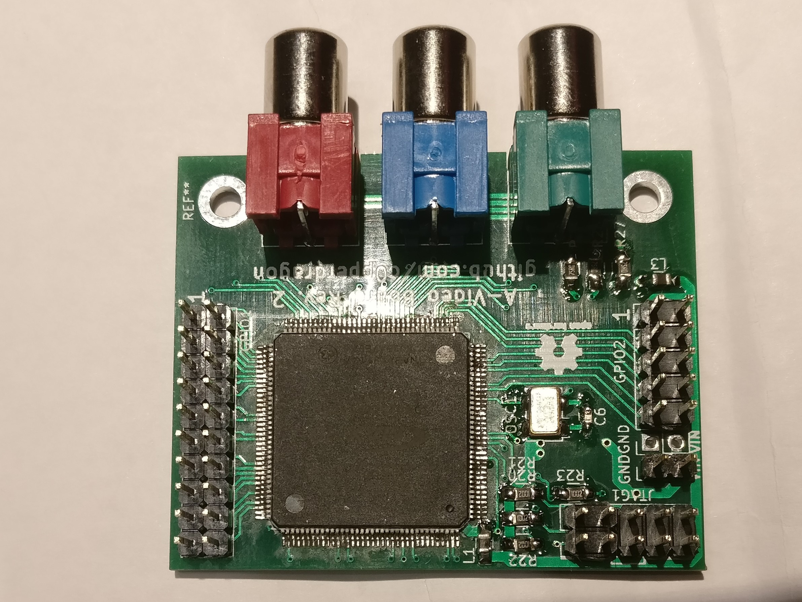
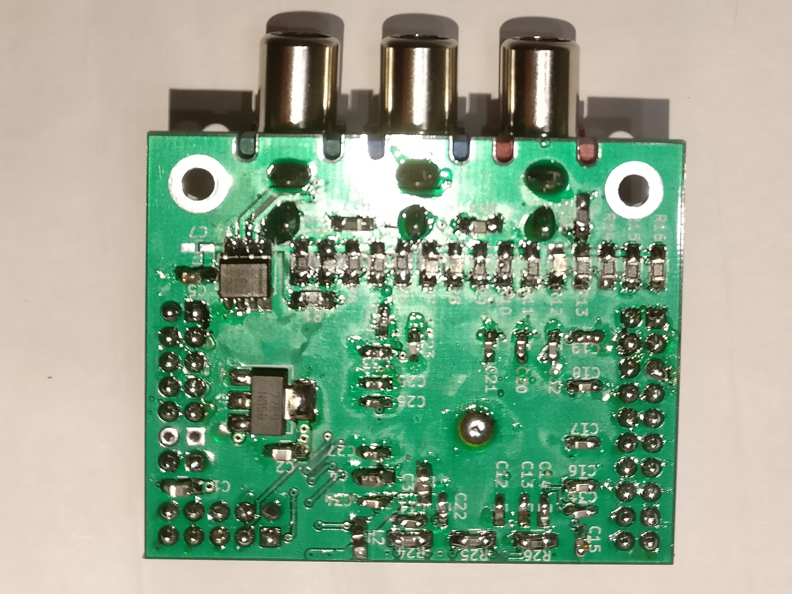

# A-Video Board

A small FPGA board with a component video interface to directly drive
an analog monitor or TV input.
Its main purpose is to create component video / RGB mods of vintage
home computers and consoles or to provide video output for hobby projects.

It consists of the purest minimum parts necessary to have a multi-purpose
FPGA combined with a simple way to generate a YPbPr signal. After much research
I finally settled on a cheap MAX 10 device in a TQFP-144 package which I can 
solder by hand (barely). The rest of the parts are pretty cheap and quite easy to solder. 

To interface any of the vintage systems to the A-Video Board, level shifters
are necessary to translate the 5 volt to 3.3 volt for the FPGA input pins. These level
shifters can be implemented in a system specific daughter board that can be stacked
on top of the A-Video board. Any such interface board can probably be implemented in a 
simple single-sided wide-pitch PCB that can be even home-etched with some experience.

Currently I have built applications of the A-Video board for 
* [Atari 8 bit machines](/atarimod)
* [ZX Spectrum](/zxspectrummod)

## Images

## Board design

The board has these main parts

* 10M02SCE144: fairly cheap FPGA of the MAX10 series
* LM1117IMPX-3.3:   linear voltage regulator
* LFSPX0024957:     25Mhz clock generator
* THS7316:          video output amplifier
* R1-R19:           three 5-bit DACs made from transistors

and various supporting passive components, mainly decoupling, filtering and pull-ups.

It has the following connectors:
* GPIO1  20-pin header that directly connects to FPGA pins
* GPIO2  10-pin header with two pins providing GND and +3.3V, the remaining 8 connect to the FPGA.
* JTAG   10-pin header for programming the FPGA (via an USB-Blaster or compatible device)
* 3 RCA sockets to output the video signal (normally YPbPr, but other formats could be produced as well).
 Note that in the schematics these sockets are denoted as BNC, but are actually RCA connectors of type 
 RCJ-046 (green), RCJ-042 (red), RCJ-045 (blue).
* GND, VIN  Provide between 4.5V and 9V as supply voltage. The board consumes about 80mA.
 
## Contact
If you plan to use an A-Video board, feel free to contact me for assistance:
reinhard.grafl (at) aon.at  
Maybe I will either have some spare PCBs I could send you to populate yourself,
or even provide you with a fully assembled board for the cost of the parts and shipping. 
