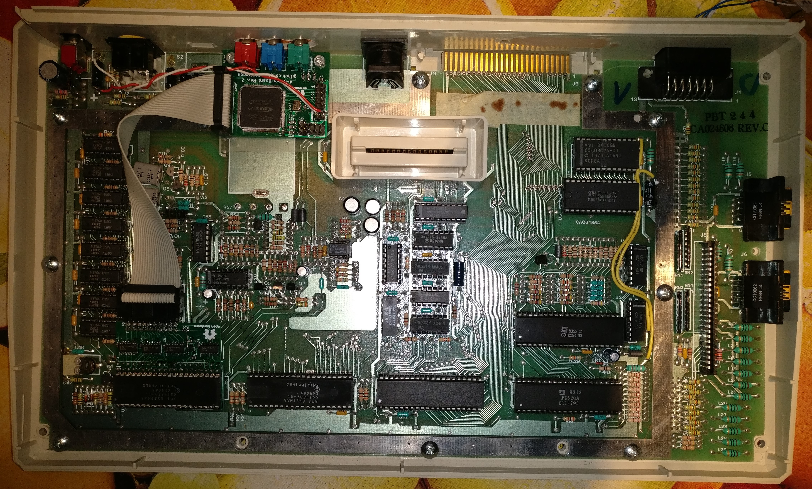

# Atari RGB Mod

Built on the A-Video board, this is a modification usable for Atari 8-bit 
computers that generate YPbPr signal in either 288p or 576p to display on
modern displays.

## Motivation

These old Atari computers generate the colour output signal directly in the weird way that was
necessary to construct a PAL or NTSC signal. The technique is called "quadrature amplitude modulation" and has the
disadvantage of not being completely reversible, so the original colours can not be reconstructed from this
signal.
Even worse, the XL line of machines does not even provide this signal directly on the video output, but
only already combined with the luminance signal as composite video. There are simple ways to provide 
separate luminance and colour, but even then the quality is pretty bad. 
This was not such a problem on cathode ray tube (CRT) displays, but on modern LCD TVs this signal looks totally
unusable.

So, no matter how I tried, I could not reliably re-construct the original colours from the colour signal output. 
The only way to really solve the issue was to intercept the necessary information in digital form to 
create a perfectly sharp and clear analog video signal by my own circuitry. 

## Building details

The FPGA chip passively listens to all relevant pins of the GTIA graphics chip and re-implements the 
relevant logic of the GTIA in its logic fabric, effectively providing a second GTIA (parts of it).

The mod board consists of two PCBs (my generic adapter board soldered to the specific Atari mod board)
that form an intermediate layer that is plugged between the GTIA and the Atari main board.
The relevant signals are tapped off into the schmidt-trigger inputs of several
74HC14D ICs. These ICs clean the signals and translate the levels down to about 3.8V.
I would prefer to have 3.3V output levels, but due to the internal protection diodes, the 5V input
voltage partly passes to the VCC rising it above the 3.3V provided by the on-board regulator.
This is pretty poor design on my part, but the FPGA inputs are safe up to 4V, so I guess I can get way 
with it ;-)

The mod board then connects with a 20pin ribbon cable to the FPGA board.

Due to a mistake in my original mod board design, the clock signal was taken from the wrong 
GTIA pin. By slightly botching the pinhead connections (remove one pin, add a solder bridge)
I could work around this issue here. The board designs in the repository are already fixed.

## Programming the FPGA

The FPGA on the A-Video board is programmed in VHDL, using the free version of the Quartus II development suite.
This chip has an on-board non-volatile program memory, so no external flash is needed and the chip has
a very short start-up time. There is a PLL built in which I use to generate a 227Mhz signal from the 25Mhz reference.
With this 227Mhz and some advanced  programming I can generate a pretty clean (2ns jitter) 14,1875 MHz
clock to drive the whole circuit and create a nice 576p signal.

## Output

The mod can be used to create three different output formats:
* 240p/288p
* 480p/576p
* 480p/576p with scanlines (default)

Selecting the output can be done by jumper connectors or an external switch:
* Connect GPIO2_8 to GPIO2_10 (or GND): 240p/288p
* Connect GPIO2_9 to GPIO2_10 (or GND): 480p/576p no scanlines

## Images

